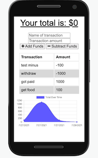

# progressive-web-app

## description

This progressive web application uses allows users to continue use of an web application even in the case that the application temporarily goes off line.

## Usage

This application relies heavily a service worker, a manifest of the static resources within the project, and cache storage.

You can view this video [here](https://youtu.be/n_e7VesdUK0)

## License

This application is covered under the MIT license. To learn more about the the MIT license, click on .

## Questions

Please send any questions about this application to me at:
[GitHub/reggiemace](https://github.com/reggiemace)

For additional questions regarding this project, feel free to contact me at:
reginaldmace36@gmail.com
